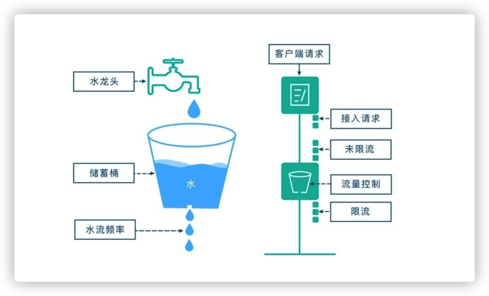
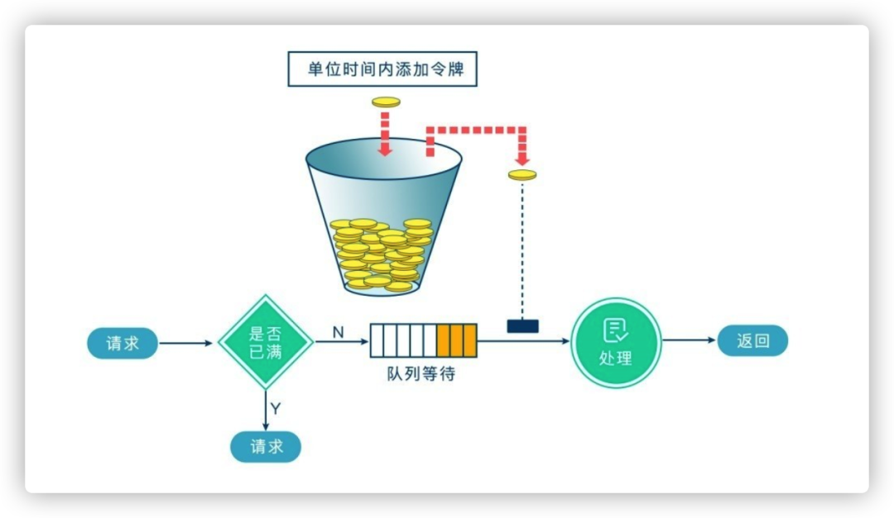

大并发大流量的请求，在突发情况下（最常见的场景就是秒杀、抢购），瞬时大流量会直接将系统打垮，无法对外提供服务。那为了防止出现这种情况最常见的解决方案之一就是限流，当请求达到一定的并发数或速率，就进行等待、排队、降级、拒绝服务等。
例如，12306购票系统，在面对高并发的情况下，就是采用了限流。在流量高峰期间经常会出现提示语；"当前排队人数较多，请稍后再试！"
~~~
限流是对某一时间窗口内的请求数进行限制，保持系统的可用性和稳定性，防止因流量暴增而导致的系统运行缓慢或宕机。
~~~
1. 计数器限流
    计数器限流算法是最为简单粗暴的解决方案，主要用来限制总并发数，比如数据库连接池大小、线程池大小、接口访问并发数等都是使用计数器算法。

    如：使用 AomicInteger 来进行统计当前正在并发执行的次数，如果超过域值就直接拒绝请求，提示系统繁忙。
2. 漏桶算法
~~~
漏桶算法思路很简单，我们把水比作是请求，漏桶比作是系统处理能力极限，水先进入到漏桶里，漏桶里的水按一定速率流出，当流出的速率小于流入的速率时，由于漏桶容量有限，后续进入的水直接溢出（拒绝请求），以此实现限流。
~~~

3. 令牌桶算法
~~~
令牌桶算法的原理也比较简单，我们可以理解成医院的挂号看病，只有拿到号以后才可以进行诊病。

系统会维护一个令牌（token）桶，以一个恒定的速度往桶里放入令牌（token），这时如果有请求进来想要被处理，则需要先从桶里获取一个令牌（token），当桶里没有令牌（token）可取时，则该请求将被拒绝服务。令牌桶算法通过控制桶的容量、发放令牌的速率，来达到对请求的限制。
~~~
